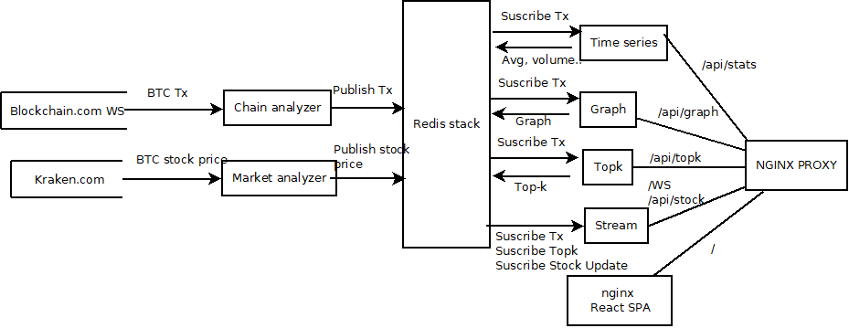
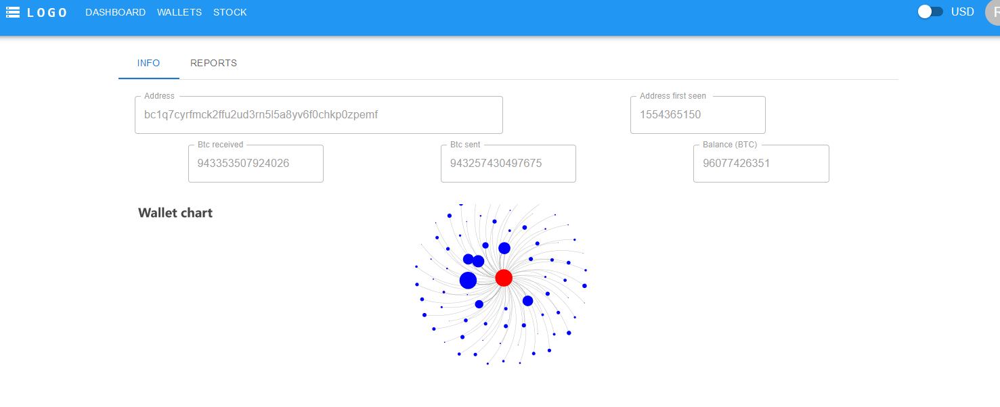
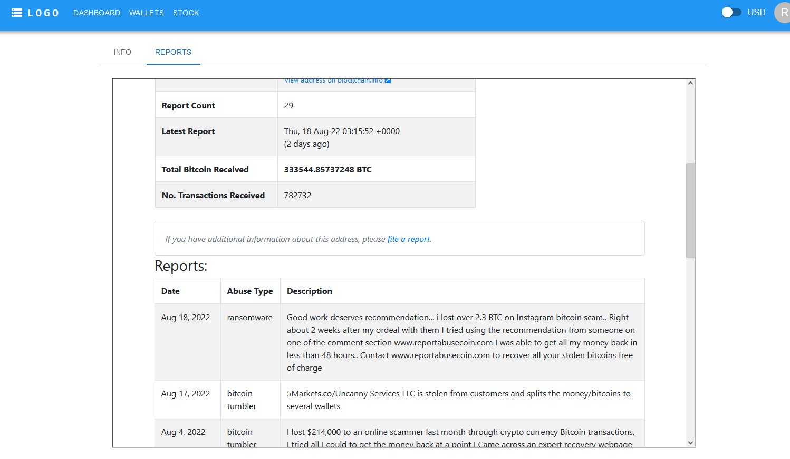

# RedisxDEVHackathon tiny btc onchain analysis

Project that queries BTC chain and discover interactions between wallets, trending wallets.

## Architecture



## Dashboard


## Wallet detail 






# Overview video (Optional)

Here's a short video that explains the project and how it uses Redis:

[Insert your own video here, and remove the one below]

[](https://youtu.be/NWUk6ef2v4k)

## How it works

The application has as its central point the redis stack.

Two nodes (market and chain) provide information through the pub/sub and the redis cache.
Graph, stats, stream and topk simply process what comes through the pub/sub, update the information in redis and expose it through an API.

* Graph maintains a database where each node is a wallet and the edges are the transactions between wallets.
* Stats maintains the information related to quotes and the number of transactions per minute and btc per minute.
* Topk maintains a list of the wallets that appear the most on the blockchain I'm sending and receiving.
* Stream simply presents information through a websocket (real time transactions, stok updates, topk).

### How the data is stored:

#### Set cache USD/EUR
```
SET market:cache:USD "{\"time\": 1661073540, \"open\": 21423.6, \"high\": 21424.3, \"low\": 21423.5, \"close\": 21424.3, \"vwap\": 21423.5, \"volume\": 0.11823173, \"count\": 4}"
```
#### Publish on pub/sub
* Transacitions
```
PUBLISH transactions:new "{...}" 
```
* TopK update
```
PUBLISH topk:updated "{\"senders\": [\"1GQdrgqAbkeEPUef1UpiTc4X...}"
```

#### Publish market stock price update

```
PUBLISH market:update {....}
```

#### Add wallet to topK
```
TOPK.ADD topk:wallets:senders "bc1q7cyrfmck2ffu2ud3rn5l5a8yv6f0chkp0zpemf"
TOPK.ADD topk:wallets:receivers "bc1q7cyrfmck2ffu2ud3rn5l5a8yv6f0chkp0zpemf"
```
#### Add onchain analysis to timeseries
* tx = number of transactions
* btc = aumnt of btc exchanged
```
TS.ADD transactions:series:btc "1661074336000" "8.92932302"
TS.ADD transactions:series:tx "1661074336000" "1"
```
#### Graph: Create node
```
GRAPH.QUERY wallets:graph "CREATE (asotepwxth:wallet{address:\"bc1qrjkw3d0pfuklk8vd45xr78xfgdf0w396k3wavu\"})"
```
#### Graph: Update edge between wallets:
```
GRAPH.QUERY wallets:graph "CYPHER source=\"bc1q7cyrfmck2ffu2ud3rn5l5a8yv6f0chkp0zpemf\" destination=\"bc1qrjkw3d0pfuklk8vd45xr78xfgdf0w396k3wavu\" hash=\"a530a08e3baa1085b8fb07875467c95a6c51437ebe097f0022b2dd074033bd4f\" amount=8.92932302 MATCH (source:wallet {address:$source}) MATCH (destination:wallet {address:$destination}) CREATE (source)-[t:transaction {amount:$amount, hash:$hash}]->(destination)" "
```

#### Timeseries: update stock (close/open/high/low)
```
TS.ADD btc:usd:bars:close "1661074356000" "21424.3"
```
### How the data is accessed:

#### Redis cache 
```
 GET market:cache:USD 
 GET market:cache:EUR 
```
#### TopK wallets

```
 TOPK.LIST topk:wallets:senders 
 TOPK.LIST topk:wallets:receivers 
```
#### Timeseries "onchain"
```
 TS.REVRANGE transactions:series:tx "1659562337568" "1661074277568"	
 TS.REVRANGE transactions:series:btc "1659562337573" "1661074277573"
```


#### Timeseries "stock"

format :  btc:[usd|usd]:bars:[close|open|high|low]
```
TS.REVRANGE btc:usd:bars:close "1659562348446" "1661074288446"
```

#### Graph search node
```
GRAPH.QUERY wallets:graph "CYPHER address=\"bc1q7cyrfmck2ffu2ud3rn5l5a8yv6f0chkp0zpemf\" MATCH (source:wallet {address:$address}) return source" 
```
## How to run it locally?

Windows

```
cd src
./run.ps1
```

Linux

```
cd src
make run
```

### Prerequisites
* Docker

### Local installation

* Clone project and make sure that docker is installed
